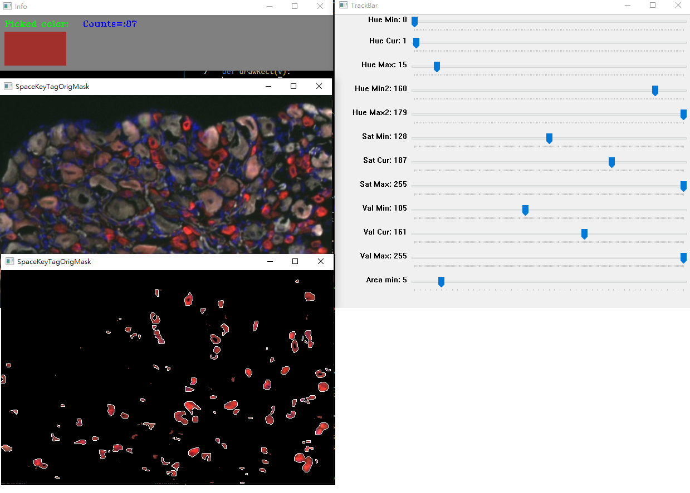

# ColorCellCount
<b>Space Bar</b> : Toggle between Original image and Filtered image 
<b>Click on image</b>: Pick color and get HSV of the pixel on "Hue Cur1, Sat Cur, Val Cur" Track bars 
<b>Area min</b>: Minimum area that will be counted as a cell 
<b>Rule</b>: Pixel's HSV matching the rule will be kept : 
&nbsp;&nbsp;((H Min1 < H < H Max1) OR (H Min2 < H < H Max2)) AND (S Min < S < S Max) AND (V Min < V < V Max) 
&nbsp;&nbsp;the reason we need two H rules is caused by overflow 
<b>Counts</b>:Dyed cell number 
 

